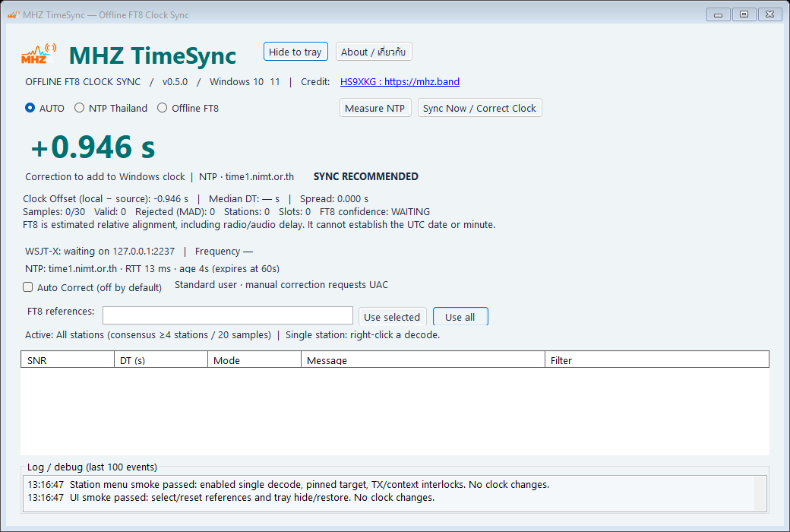

# MHZ TimeSync — Offline FT8 Clock Sync

Windows MVP **v0.5.0**, C# / .NET 10 / WinForms. Designed for Windows 10 22H2 x64 and Windows 11. Portable self-contained x64 release: extract the ZIP and run **MHZ.TimeSync.exe**. No separate .NET runtime installation is needed. This MVP is unsigned; Windows may show an unknown-publisher warning. Source is included for inspection and local builds.

**Credit: HS9XKG : [https://mhz.band](https://mhz.band)**

Contact: [Facebook — MHZ Band Radio](https://www.facebook.com/mhzbandradio) / [Website — mhz.band](https://mhz.band)



## ใหม่ใน v0.5.0 — Compact UI / Logo / Icon

- ปรับหน้าต่างหลักจาก 1100×930 เป็น **1040×700** และจำกัดขนาดตาม Windows Working Area จึงไม่ทับ taskbar บนจอ 1366×768
- ย่อได้ถึง 820×600; ตาราง decode และ log ยืด/หดตามพื้นที่ ส่วนข้อมูล Clock Offset, source และสถานะยังอยู่ด้านบน
- ลดช่องว่างและขนาดตัวอักษรเฉพาะจุดเพื่อให้ดูครบในหน้าจอเดียว โดยไม่ตัดฟังก์ชันเดิม
- เพิ่มโลโก้ MHZ TimeSync ที่ดัดแปลงจากแบรนด์ MHZ.Band และ multi-resolution ICO ขนาด 16–256px
- ใช้ไอคอนเดียวกันในไฟล์ EXE, title bar, taskbar, system tray และหน้า About
- หน้า About ลดเป็น 780×620 และแสดงโลโก้/เวอร์ชัน 0.5.0

## ใหม่ใน v0.4.0 — Version / About

- หน้าหลักแสดง version จาก assembly metadata จริง จึงตรงกับ Properties ของไฟล์ EXE
- ปุ่ม **About / เกี่ยวกับ** แสดงชื่อโปรแกรม เวอร์ชัน ผู้พัฒนา คำอธิบายภาษาไทย/อังกฤษ และคำเตือนว่า FT8 เป็น Estimated Time Correction
- มีลิงก์ Website และ Facebook ที่เปิดด้วย default browser
- แสดง privacy statement: ไม่มี telemetry; log/decode อยู่ใน memory และไม่บันทึกลง disk
- ปุ่ม **Copy system info / คัดลอกข้อมูลระบบ** คัดลอก version, Windows/CPU architecture, .NET runtime และ UDP endpoint เพื่อใช้แจ้งปัญหา โดยไม่รวม callsign, decode, path หรือข้อมูลส่วนตัว
- ใส่ Product, File Version, Company, Description และ Copyright ใน EXE metadata สำหรับหน้า Properties → Details ของ Windows

สิ่งที่โปรแกรมแจกทั่วไปมักระบุและ v0.4.0 ใส่แล้ว: product/version, ผู้พัฒนา, วัตถุประสงค์, contact/support, compatibility, copyright, privacy และข้อจำกัดสำคัญ. ยังไม่ใส่ License แบบ open source เพราะเจ้าของยังไม่ได้เลือกรูปแบบสิทธิ์; ปัจจุบันระบุ All rights reserved และ source package มีไว้สำหรับตรวจสอบ/build ตามการส่งมอบนี้

## ใหม่ใน v0.3.0 — Sync with this Station

1. รับ FT8 ใน WSJT-X แล้ว **คลิกขวาที่แถว decode** ใน MHZ TimeSync
2. เลือก **Sync with this Station**
3. ตรวจ sender callsign, message, DT และ correction ในหน้าต่างยืนยัน แล้วกด OK; หากไม่ได้เปิดแอปเป็น admin จะขอ UAC ตามเดิม

คำสั่งนี้เป็น **manual override อ้างอิงสถานีเดียว จาก decode แถวที่เลือกโดยตรง**. ไม่ต้องรอ 4 สถานีหรือ 20 ตัวอย่าง และใช้ได้แม้สถานีนั้นอยู่นอก allowlist ของ FT8 references หรือ main mode เป็น AUTO/NTP. ค่าที่ใช้คือ `correction = −DT` ของแถวนั้น เช่น DT +1.200s → ปรับนาฬิกา −1.200s. ไม่ได้ใช้ median ของสถานีนั้นย้อนหลัง และไม่ได้ใช้ NTP แทนแถวที่เลือก

**Auto Correct จะถูกปิดเมื่อเริ่มคำสั่งนี้ แม้ยกเลิก confirmation**. โหมด consensus/Auto เดิมยังใช้เกณฑ์หลายสถานีเหมือนเดิม. หน้าต่างยืนยันแจ้งชัดว่าไม่มี multi-station consensus และไม่ใช่ absolute UTC; ผู้ใช้เลือกเชื่อถือ clock ของสถานีอ้างอิงเอง

เมนูจะไม่พร้อมใช้ถ้าแถวเกิน 45s, เป็น replay/WAV/low-confidence/non-FT8, sender ไม่ชัดเจน, DT เกิน ±5s, ยังวัด NTP/แก้เวลาอยู่ หรือไม่มี Status FT8 RX สดภายใน 45s. ต้องปิด Enable Tx ก่อน. เมนูที่ถูกปิดใช้งานมีคำอธิบาย tooltip. หลังยืนยันจะตรวจอายุ/สถานะอีกครั้ง; เปลี่ยน receiver/band/mode, Clear/Close หรือ clock step จะยกเลิกแถวเก่า

เมื่อมี decode ใหม่แทรกเข้าตารางระหว่างเปิดเมนู แอปยังคงอ้างอิง **decode เดิมที่คลิก**. หลังแก้สำเร็จล้างข้อมูลเก่าและรอข้อมูลใหม่ 15s; log บันทึก callsign, DT และ correction ที่ใช้. เครดิตและ Hide to tray ยังคงอยู่

## ใหม่ใน v0.2.0 — เลือกสถานีอ้างอิง / Hide

- ใส่ callsign ในช่อง **FT8 references** คั่นด้วย comma, space หรือ semicolon แล้วกด **Use selected**. ไม่แยกตัวพิมพ์เล็ก/ใหญ่; ใช้ sender callsign แบบตรงตัว เช่น `K1ABC/P` แยกจาก `K1ABC`
- ใช้เฉพาะสถานีที่เลือกคำนวณ Offline FT8 และ AUTO fallback. NTP ไม่ได้รับผลกระทบ. สถานีอื่นแสดงในตารางพร้อม `Filtered: station not selected`
- **Active** แสดงรายชื่อที่มีผลจริง; พิมพ์แก้เฉย ๆ ยังไม่มีผลจนกด Use selected. ข้อมูลผิด/ช่องว่างจะไม่แทนที่ค่าปัจจุบัน กด **Use all** เพื่อกลับไปใช้ทุกสถานี
- ทุกครั้งที่ Apply/Use all จะล้างตัวอย่างเดิมและปิด Auto Correct เพื่อเก็บใหม่จากชุดสถานีที่เลือก; รายชื่อไม่บันทึกข้ามการเปิดแอป
- สำหรับปุ่ม consensus **Sync Now / Correct Clock** ยังคงต้องมี **อย่างน้อย 4 สถานีที่รับได้จริง, 20 valid samples และ 3 RX slots**. เลือกสถานีเดียวใน allowlist จะไม่ปลดล็อกปุ่มนี้; HIGH/Auto ต้อง ≥5 สถานี. หากต้องการอ้างอิงสถานีเดียวด้วยตัวเอง ใช้เมนูคลิกขวาใหม่ใน v0.3.0
- **Hide to tray** ซ่อนหน้าต่าง แต่รับข้อมูลและทำงานต่อ รวมถึง Auto Correct ถ้าผู้ใช้เปิดไว้. ดับเบิลคลิกไอคอน tray หรือคลิกขวา **Show MHZ TimeSync** เพื่อเปิดกลับ; **Exit** ออกจากโปรแกรม. Windows อาจเก็บไอคอนไว้ในเมนู ^ ของ taskbar
- ปุ่ม **—** มุมหน้าต่างยุบลง taskbar ตามปกติ; ปุ่ม **X** ปิดโปรแกรมจริง ไม่ซ่อน. ระหว่าง clock helper ทำงานต้องรอให้เสร็จก่อน Exit
- เครดิต HS9XKG บนหน้าแอปคลิกเปิด https://mhz.band ใน browser เริ่มต้นได้

## เริ่มใช้กับ WSJT-X

1. เปิด MHZ.TimeSync.exe ตามปกติ ยังไม่ต้อง Run as administrator
2. ใน WSJT-X ไปที่ **File → Settings → Reporting → UDP Server**
3. ตั้ง UDP Server เป็น **127.0.0.1**, UDP Server port **2237** ใช้ IPv4 ตามนี้ ไม่ใช้ multicast/IPv6 ใน MVP
4. เปิด **Accept UDP requests** ตามรูปแบบการตั้งค่าที่ WSJT-X รุ่นนั้นรองรับได้ แต่แอปนี้รับอย่างเดียว ไม่ส่งคำสั่งควบคุมวิทยุ จึงไม่จำเป็นต้องเปิดเพื่อรับ Decode/Status; **Notify on accepted UDP request** ไม่จำเป็น
5. กด OK แล้วเลือกโหมด FT8 เปิด Monitor รับสัญญาณ ตรวจแถว decode และ WSJT-X connected ใน MHZ TimeSync
6. หากไม่มี Status/frequency ให้เปิด Settings แล้วกด OK หรือเปลี่ยน band กลับมา WSJT-X ส่ง Status เมื่อการตั้งค่าหรือสถานะเปลี่ยน
7. ปิด **Enable Tx** และหยุดส่งก่อนกด Correct Clock; ถ้าสถานะ RX เก่ากว่า 45 วินาที ปุ่มจะรอ Status ใหม่

**Port conflict:** UDP 2237 ใช้ตัวรับหลักได้เพียงตัวเดียว แอปตั้ง exclusive bind เพื่อไม่สุ่มแย่ง packet กับ GridTracker/JTAlert/แอปอื่น ให้ใช้ UDP forwarding ของแอปนั้นมายัง 127.0.0.1:2237 โดยย้าย input port ของแอปตัวกลาง หรือปิดตัวรับที่ชนแล้วเปิด MHZ ใหม่ MVP ยังไม่มีช่องเปลี่ยน port หรือ multicast

## โหมดและการอ่านตัวเลข

| Mode | พฤติกรรม |
|---|---|
| AUTO | ลอง NTP ก่อน ถ้าใช้ไม่ได้จึงใช้ FT8 consensus ที่ผ่านเกณฑ์ และลอง NTP ใหม่ประมาณทุก 60 วินาที |
| NTP Thailand | ใช้ NTP เท่านั้น ปุ่ม Measure NTP วัดใหม่ได้ |
| Offline FT8 | ใช้ DT ของ FT8 เท่านั้น ไม่ probe NTP อัตโนมัติ (probe ที่กำลังทำก่อนเปลี่ยนโหมดอาจจบได้ แต่ไม่ถูกใช้) |

ตัวเลขใหญ่คือ **correction ที่จะบวกกับ Windows UTC clock** ไม่ใช่ค่าที่จะนำไปลบอีกครั้ง ส่วน **Clock Offset = local − source = −correction** แสดงในรายละเอียด

FT8: `correction = −median DT`. ตัวอย่าง median DT `+0.70s` → ถอยนาฬิกา `0.70s`; median DT `−0.70s` → เดินนาฬิกาไปหน้า `0.70s`. DT คือเวลาที่สัญญาณมาถึงเทียบช่วงรับตามนาฬิกาท้องถิ่น: เครื่องรับที่เร็วจะเห็นสัญญาณมาถึงช้า ทิศทางนี้มี unit test และยังต้องตรวจรับกับ radio/audio chain จริงตามขั้นตอนท้ายเอกสาร

**FT8 เป็น Estimated Time Correction ไม่ใช่ absolute UTC.** ค่านี้รวม clock bias ของสถานีส่ง, propagation และ audio/radio latency; หลายสถานีอาจผิดเหมือนกันได้ Confidence คือความสอดคล้องของข้อมูล ไม่ใช่โอกาสถูกต้องทางสถิติหรือใบรับรอง UTC. FT8 แก้วันที่/ชั่วโมง/นาทีที่ผิดไม่ได้ และถ้าเครื่องคลาดมากจน decode ไม่ได้จะไม่มีค่าประมาณ ให้ใช้ NTP/GPS/ตั้งเวลาคร่าว ๆ ก่อน

| Absolute correction | Status |
|---|---|
| < 0.20s | GOOD |
| 0.20 ถึง < 0.50s | OPTIONAL |
| 0.50–1.50s | SYNC RECOMMENDED |
| > 1.50s | WARNING; manual review only |

## Consensus และ guardrails

- รับ WSJT-X schema 2/3 แบบ big endian; DT อ่านเป็น IEEE double 64-bit; Decode อ่าน SNR, mode, message, QTime, audio frequency, flags; Status อ่าน dial frequency/mode/Tx
- ใช้เฉพาะ FT8 (`~`), New=true, ไม่ใช่ replay, ไม่ใช่ WAV playback, ไม่ใช่ low-confidence, DT finite ภายใน ±5s, SNR −30 ถึง +60dB; หาก packet รุ่นเก่าไม่มี OffAir flag จะไม่ใช้แก้เวลา
- ถอด **sender** จาก CQ และ QSO แบบมาตรฐาน; hashed callsigns / free text / contest รูปแบบที่ไม่รองรับจะถูกกรอง ไม่ใช้ recipient เพิ่มจำนวนสถานี; slash callsigns รองรับแบบพื้นฐาน (ยังไม่ normalize portable aliases)
- Window 30 ตัวอย่าง อายุไม่เกิน 180s, สูงสุด 6 ต่อ callsign; ตัด packet ซ้ำจาก station+slot เดียวกัน และเลือก WSJT-X instance เดียว (เปลี่ยนเมื่อ instance เก่าหาย >60s)
- หาศูนย์กลางจาก median ของ median แต่ละสถานี เพื่อให้น้ำหนักสถานีเท่ากัน แล้ว reject เมื่อ `abs(DT − center) > max(0.10s, 3 × 1.4826 × MAD)`; MAD วัดจากตัวอย่างเทียบศูนย์กลางนั้น
- Median DT สุดท้ายเป็น median ของ median ต่อสถานีที่ผ่านกรอง; Spread คือ max−min ของ valid samples
- **Ready:** valid ≥20, ≥4 sender callsigns, ≥3 RX slots, spread ≤0.35s, valid ล่าสุดอายุ ≤45s
- **HIGH:** Ready และ ≥5 สถานี, spread ≤0.15s; นอกนั้น Ready เป็น MEDIUM
- Samples/Valid/Rejected เป็นตัวเลขใน rolling window; Rejected หมายถึง MAD outlier เท่านั้น ส่วน replay/quality/duplicate แสดงใน Filter column แต่ไม่นับเข้าตัวอย่าง
- เปลี่ยน band/frequency/mode, WSJT-X Clear/Close, นาฬิกาถูกปรับภายนอก >250ms หรือแก้เวลาสำเร็จ จะทิ้งค่าที่สะสม หลังแก้สำเร็จงดรับ sample 15s เพื่อไม่ใช้ decode ที่ค้าง
- **Auto Correct ปิดทุกครั้งที่เปิดแอปและเมื่อเปลี่ยน mode**; ต้องเปิดแอปแบบ administrator เอง; เฉพาะ HIGH (NTP ต้อง RTT ≤200ms), correction 0.50–1.50s, พัก ≥5 นาที และไม่ TX/Enable Tx ไม่มีการเปิด admin/UAC อัตโนมัติซ้ำ ๆ ในโหมดนี้
- ไม่ส่งคำสั่งไป WSJT-X; สถานะ Tx เป็น interlock จากข้อมูลล่าสุด ไม่ใช่ hardware interlock ผู้ใช้ต้องหยุดส่งเองก่อนแก้เวลา โดยเฉพาะช่วง UAC

## NTP Thailand

Fallback ตามลำดับ: `time1.nimt.or.th`, `time2.nimt.or.th`, `time3.nimt.or.th`, `time.navy.mi.th`, `clock.nectec.or.th` (availability ขึ้นกับเครือข่าย/ผู้ให้บริการ ไม่มีการรับประกันทุก host ออนไลน์)

ใช้ UDP 123, DNS/receive deadline 2.5s ต่อ sample; ลอง 3 samples ต่อ server และใช้ค่าที่ RTT ต่ำสุดเมื่อ correction ทั้งสามต่างกันไม่เกิน 0.20s. Server ใดล้มเหลวจะข้ามไปตัวถัดไป. ตรวจ mode/version/leap/stratum, Kiss-o'-Death, originate timestamp, timestamp ไม่เป็นศูนย์, root dispersion/delay, clock step ระหว่าง request, RTT ≤1s. ค่าใช้ได้ 60s. Safety cap correction ±300s; หากวันที่/นาทีผิดมากให้ตั้งเองก่อน

คำนวณตาม four-timestamp exchange:
`offset = ((t2 − t1) + (t3 − t4)) / 2`
`delay = (t4 − t1) − (t3 − t2)`
รองรับ NTP era rollover โดยเลือก era ใกล้วันที่เครื่อง (ต้องตั้งปี/วันที่ใกล้จริง). เป็น plain NTP ไม่ใช่ NTS; jitter/เส้นทางไม่สมมาตรและ server bias ยังมีผล ไม่ใช่เครื่องมือ metrology

## Windows privilege และการแก้เวลา

กด **Sync Now / Correct Clock** → ตรวจค่าใน confirmation → UAC ของ helper → `SetSystemTime` ด้วย UTC. ใช้ offset กับเวลาปัจจุบันทันที ไม่เอา UTC เก่าตอนวัดไปตั้ง. helper ปฏิเสธถ้า UAC ช้ากว่า 30s หรือ clock ถูกเปลี่ยนระหว่างรอ >200ms. ยกเลิก UAC แล้วแอปยังดูข้อมูลได้ตามปกติ

หากไม่มีสิทธิ์ admin หรือ policy ไม่อนุญาต **Change the system time** จะแจ้งใน log. แอปไม่เปลี่ยน service, registry, Windows Time configuration หรือ policy ให้เอง. Windows Time/domain sync อาจปรับเวลาทับภายหลัง; เลือก time authority เดียวในการทดสอบ และอย่าปิดบริการบนเครื่ององค์กรโดยไม่ตกลงกับผู้ดูแล. การ step clock มีผลต่อ log และแอปอื่น

MVP เป็น desktop app มี system tray แต่ไม่มี service/persisted settings; log เก็บในหน่วยความจำ 100 รายการ, decode table 50 แถว ไม่ส่ง telemetry และไม่เขียนประวัติ callsign ลง disk

## Build / run จาก source

ติดตั้ง **.NET 10 SDK** บน Windows (Visual Studio ไม่จำเป็น). จากโฟลเดอร์นี้:

```powershell
dotnet build src/Mhz.TimeSync.App -c Release
dotnet run --project tests/Mhz.TimeSync.Tests -c Release
dotnet run --project src/Mhz.TimeSync.App -c Release
```

สำหรับ UAC ให้รัน apphost `src/Mhz.TimeSync.App/bin/Release/net10.0-windows/MHZ.TimeSync.exe` โดยตรง ไม่เรียก `dotnet MHZ.TimeSync.dll`

แพ็ก self-contained:

```powershell
./build.ps1
# หรือ Windows ARM64 (ต้องทดสอบบน ARM64 เพิ่ม)
./build.ps1 -Runtime win-arm64
```

ได้ `artifacts/win-x64/MHZ.TimeSync.exe` และ ZIP ใน artifacts. ถ้า PowerShell policy ไม่ยอมรัน script ให้ใช้คำสั่ง dotnet ใน build.ps1 ด้วยตัวเอง ไม่จำเป็นต้องเปลี่ยน policy เครื่อง. Build/publish ครั้งแรกต้องมี Internet เพื่อดาวน์โหลด runtime packs

โครงสร้าง:
- `src/Mhz.TimeSync.Core` — parser, consensus, correction policy, NTP
- `src/Mhz.TimeSync.App` — WinForms, UDP lifecycle, selection, UAC helper
- `tests/Mhz.TimeSync.Tests` — console tests ไม่มี test packages ภายนอก; ไม่มีการเปลี่ยนนาฬิกา

## ตรวจรับ / ทดสอบต่อกับสถานีจริง

1. Test runner ต้อง exit 0; ครอบคลุม corrupted/truncated packets, callsign, single-station rejection, median/MAD, freshness, quality flags, threshold/auto gates, NTP validation/sign/2036 rollover
2. ทดสอบเครือข่ายอย่างเดียว: `dotnet run --project tests/Mhz.TimeSync.Tests -- --ntp` (ไม่เปลี่ยนเวลา)
3. เปิด UI เลือก Offline FT8 และ **ปิด Auto Correct**; รัน `dotnet run --project tests/Mhz.TimeSync.Tests -- --simulate` เพื่อส่ง 30 synthetic decodes ใน 5 รอบ (75 วินาที). ควรได้ valid 25/rejected 5/5 สถานี/HIGH/correction ประมาณ −0.73s. Simulator ไม่ส่ง Status จึงปุ่มแก้เวลาจะถูกล็อก — ห้ามใช้ simulated data ไปแก้นาฬิกาจริง
4. รับ FT8 จริง ตรวจ SNR/DT/message เทียบ WSJT-X และ band/frequency; สถานีเดียวหรือ replay/WAV ต้องไม่ทำให้ Ready
5. ทดสอบถอด Internet / block UDP123: AUTO ต้อง fallback เมื่อ probe จบ; NTP-only ต้องไม่ใช้ FT8; กลับออนไลน์ต้องเปลี่ยนกลับ NTP
6. ใน **เครื่องทดสอบแยก** และหยุด TX: ตั้งเวลาให้เร็ว +1s แล้วรับ ≥20 valid samples หลายสถานี DT ควรเลื่อนบวกประมาณ +1s; correction ต้องติดลบ ตรวจ UAC cancel ไม่เปลี่ยนเวลา จากนั้นอนุมัติและรับข้อมูลใหม่ DT ควรใกล้ศูนย์ (หัก latency ของระบบจริง). ทดลองช้า −1s ด้วยเพื่อยืนยันทิศทาง
7. ทดสอบข้อมูลเก่า, port ชน, เปลี่ยน band, Clear, เปิดสอง WSJT-X instances, sleep/resume, เปิด TX และ Auto Correct cooldown; ไม่มี correction ระหว่าง Tx/Enable Tx หรือเมื่อ confidence ไม่พอ
8. ตรวจ UI บน Windows 10/11 และ scaling 100/150/200% เพิ่มเติมก่อนแจกวงกว้าง; ผลทดสอบที่ทำจริงในแพ็กนี้อยู่ใน `VALIDATION.md`

## แหล่งอ้างอิง

- WSJT-X protocol: https://github.com/WSJTX/wsjtx/blob/master/Network/NetworkMessage.hpp
- WSJT-X guide: https://wsjt.sourceforge.io/wsjtx-main_en.html
- NTP four timestamps: https://www.rfc-editor.org/rfc/rfc5905.html
- NIMT: https://www.nimt.or.th/nimt_time_display.php
- รายชื่อ server ในเอกสาร NECTEC: https://www.nectec.or.th/standard/wp-content/uploads/2022/10/NTS3009_1-2565.pdf
- Windows SetSystemTime: https://learn.microsoft.com/en-us/windows/win32/api/sysinfoapi/nf-sysinfoapi-setsystemtime
- .NET Windows support: https://learn.microsoft.com/en-us/dotnet/core/install/windows

